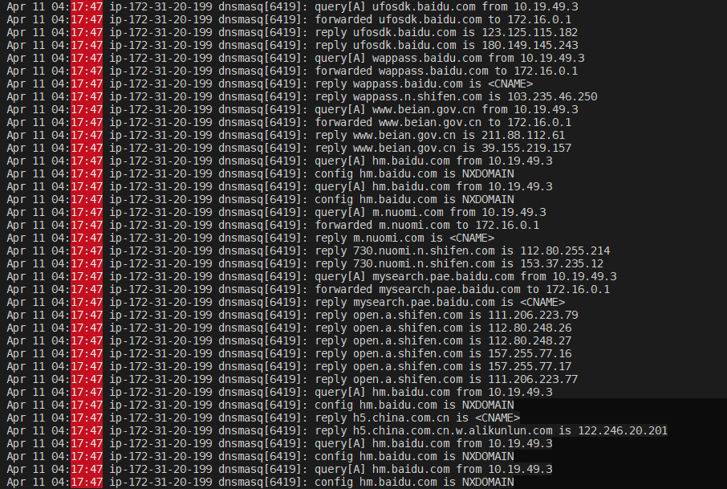
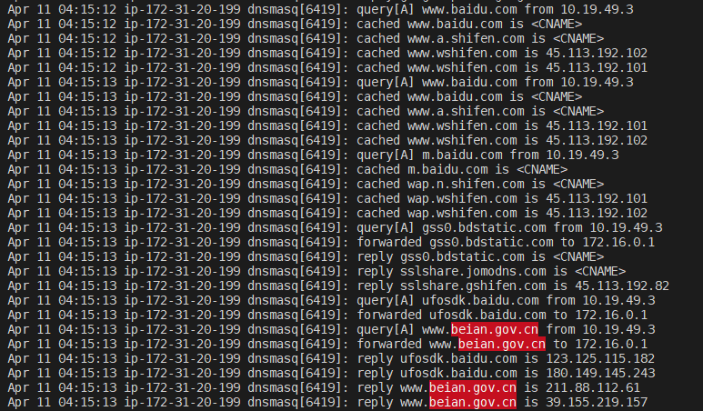
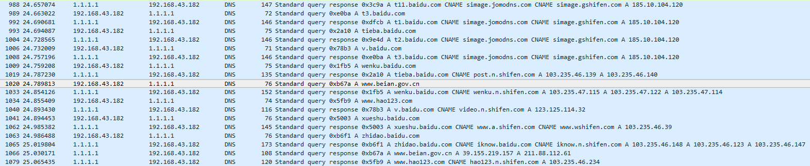

# Analysis

Due to my responsibility for this hobby research to prevent distributing misleading or misunderstanding information, and suggestions made by other researchers to discover more findings or correct me if I did something wrong. **As an intention for this research I told everyone in Thai, we couldn't and shouldn't make a conclusion in this moment until we can see everything clearly.** Thus, this is an analysis for the DNS requests to `beian.gov.cn`.

As shown on the picture that the DNS requests to `beian.gov.cn` was made, the picture was made by running `grep -arl ".cn" /var/log/syslog*` which mean that only `.cn` will be shown. 

But after carefully analyze a series of packets, I can conclude that the DNS requests to `beian.gov.cn` was made by some domain names on behalf of `baidu.com` which I manually entered to evaluate the rules.

You can see that before the query to `beian.gov.cn` was made, there are a bunch of query happened at the same time as follows:

- `ufosdk.baidu.com`
- `wappass.baidu.com`
- `wappass.n.shifen.com` and
- `www.beain.gov.cn`

Another requests to `beian.gov.cn`:

As shown above, the requests to `www.beain.gov.cn` always happened after `baidu.com` related domains. So, I try to access `baidu.com` again from another network and this is what I've found:

The DNS request to `www.beain.gov.cn` is there.